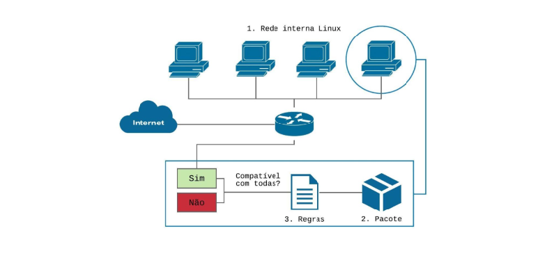
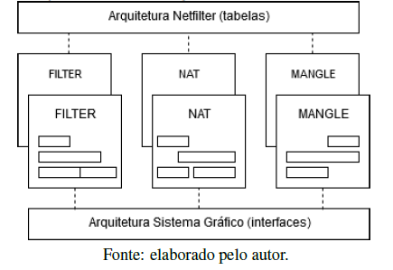
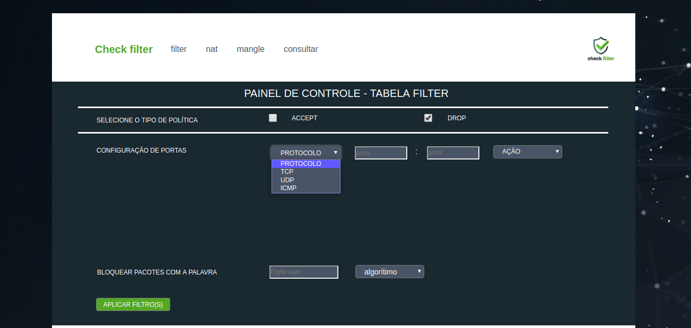
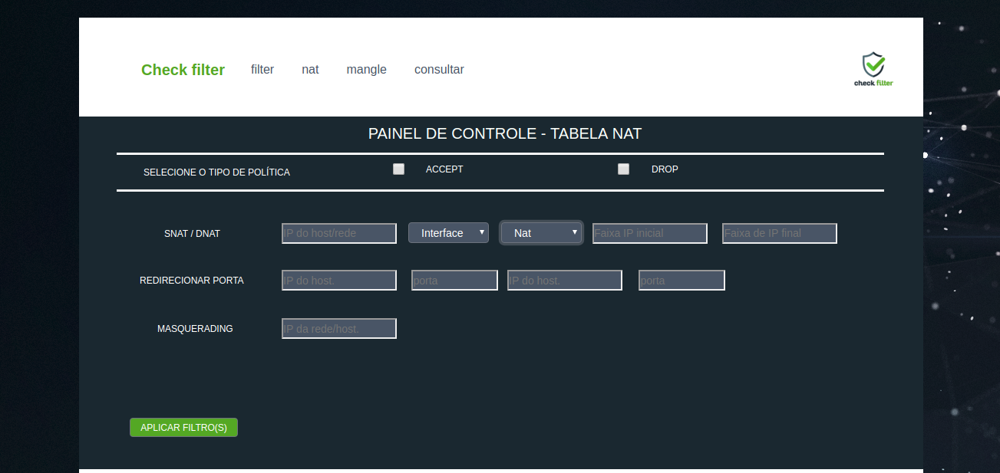
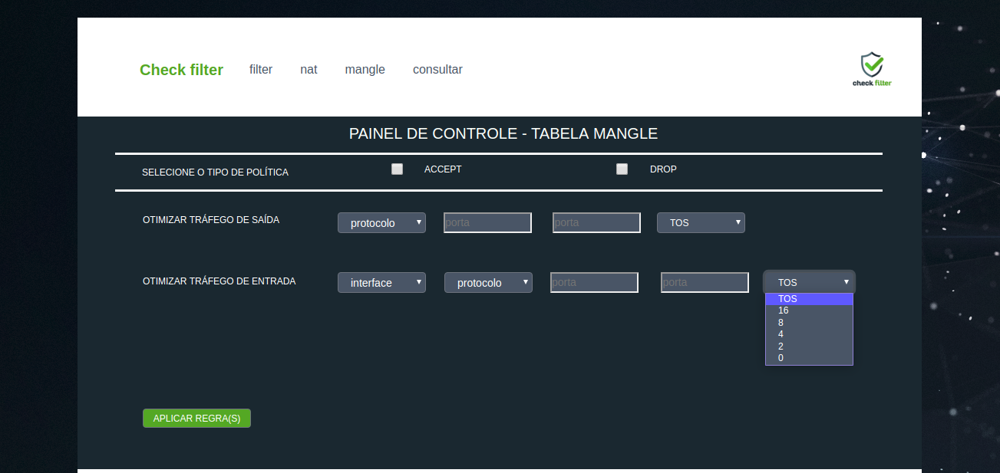
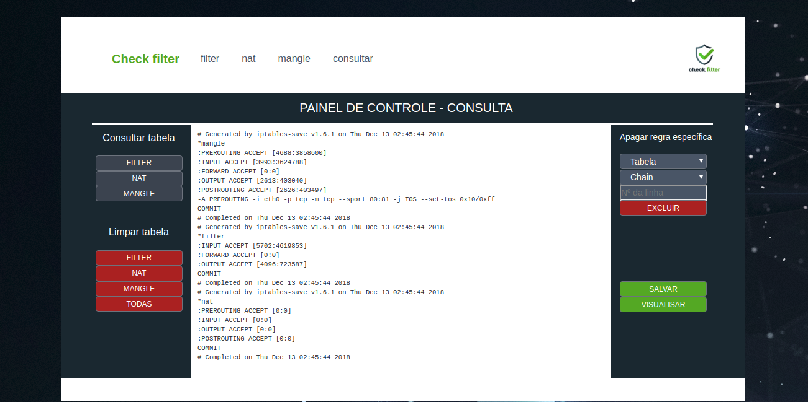

<h1 align="center"> Check Filter ✔️ </h1>

<h1 align="center"> Interface Gráfica Auxiliar na Configuração de Filtros de Pacotes em um Ambiente Linux </h1>


= 3.0&color=blue&style=plastic&logo=php"/>


<p>

> Status do Projeto: Em desenvolvimento :warning:


### Resumo
Acompanhando a expansão das redes computacionais, as tecnologias
de segurança são indispensáveis na protecão das informações e recursos de
*hardware* nas redes privadas. Uma técnica segura, estável e eficaz disponível
para ambientes GNU/Linux é o sistema de filtro de pacotes baseado no conjunto
de ferramentas *Netfilter*, configurado pelo *iptables* através de linhas de código,
tarefa que requer conhecimento técnico e criteriosa análise. Projetando um ambiente
centrado no usuário para configuração, identificou-se a possibilidade de
desenvolver uma interface gráfica que auxilie a configuração das regras otimizando
o tempo de sua implantacão e melhorando seu gerenciamento.

---
### 1. Introdução
Atualmente, na rede mundial de computadores, existem incontáveis processos em andamento
que são sigilosos, ou seja, somente a origem e o destino destes dados e informacões
devem ter conhecimento de seu conteúdo, no entanto, para que tais dados sejam protegidos
torna-se imprescindível a aplicação de métodos e tecnologias flexíveis, versáteis e
que tornem as redes privadas mais seguras contra ataques de _crackers_ oriundos da rede
externa.
    O componente de filtragem de pacotes tem por função analisar todos os pacotes
que trafegam na rede por meio de regras previamente configuradas, corrigindo e/ou
minimizando vulnerabilidades existentes, proporciona maior flexibilidade e controle ao
administrador, é extremamente útil em situações simples de segurança visto que atua no
bloqueio global de tipos específicos de pacotes que trafegam entre redes e no bloqueio
de serviços. Sua implantaçao é de baixo custo, causa pouco impacto no desempenho,
fornece controle de acesso e serviços para toda a rede.
    Acoplado ao Kernel dos Sistemas Operacionais GNU/Linux com versões 2.4
ou superiores o subsistema de filtro de pacotes nativo denominado _Netfilter_ permite a
configuração de regras que atuarão no bloqueio ou liberação de tráfego de pacotes na rede,
e, para executá-las corretamente, requer conhecimento técnico e experiência de quem as
configura, pois podem ocorrer diversos tipos de erros durante a sintaxe das regras que
seguem uma lógica e uma padronização.
    Tomado o conhecimento destes parâmetros identificou-se a possibilidade de desenvolver
uma aplicacão _localhost_ que auxilie na configuração e na aplicação dos filtros
que atuarão no controle automático do tráfego da rede. Por meio de uma uma _interface_
simples, amigável e intuitiva, esta apresentará opções de configuração dinâmica e objetiva,
reduzindo assim o tempo de configuração de um _firewall iptables_.

---
### **2. Fundamentação Teórica**

Apresentam conceitos de autores sobre termos essenciais para o entendimento e 
desenvolvimento do trabalho.

### **2.1 *Firewall***

Um firewall para Chapman at al. (1995), consiste em um componente ou um conjunto de
componentes que restringem o acesso de uma rede protegida e a internet, ou entre outros
conjuntos de rede.
Para Cheswick et al.(2005), *firewall* é qualquer equipamento ou software que limita
o acesso à rede.
### **2.2 Filtro de Pacote**

Para autor >Chapman (1992), um filtro de pacotes é um processo que atua no 
bloqueio ou liberação de pacotes de dados pela *interface* da rede, utilizando
um conjunto de regras de filtragem pré-configuradas e a anélise é feita nas 
informações contidas no cabeçalho de cada pacote individualmente.
    Cheswick e Bellovin (2005) ressaltam que a utilização de um filtro de pacotes é
uma solucão barata e útil na segurança de redes, pois permite filtrar pacotes com base nos
endereços de origem ou destino ou nos números de porta.
    Todos os pacotes que trafegam na rede são analisados um a um e ações serão
aplicadas nos pacotes que atendam ás restrições dos filtros, os pacotes que não se encaixem
nas restrições seguirão seu fluxo de processamento normalmente para seu destino.
    À princípio, a filtragem de pacotes, atua nas camadas de rede e transporte, segundo o
modelo *OSI*.
    A Figura 1 exemplifica, de forma global, como o filtro de pacotes atuará na rede.
    Todo o tráfego de pacotes que circular na rede interna será verificado pelas *chains* 
configuradas pelo administrador em um *host*. 
    Os pacotes oriundos da rede externa serão analisados pelos filtros e, de acordo 
com as regras implementadas, caso atendam ás condições
de configuração, chegarão ao *IP* de destino. Caso os pacotes não estejam em conformidade
com a configuração, serão bloqueados.

    Figura 1. Visão global do processo de filtragem de pacotes.




### **2.3 *IPtables***

O autor Purdy (2004) define o *iptables* como um utilitário de linha de comando fortemente
acoplado ao sub-sistema de filtragem de pacotes, disponível no *Kernel* dos sistemas
*GNU/Linux* com versões 2.4 e superiores, um conjunto de ferramentas nativo denominado
*Netfilter*.

---

### **3. Tecnologias**

Nesta seção são conceituadas as tecnologias escolhidas para a codificação da *interface*
*Check Filter* que impacta diretamente em sua arquitetura e componentes gráficos empregados,
pois devem dar suporte para configuração de regras que foram selecionadas para
configuração no ambiente gráfico.


### **3.1 *Netfilter***

O *Kernel* do *Linux* é o núcleo do sistema operacional *GNU/Linux*, que serve de base
para o desenvolvimento, execução de outros programas e controle de *hardware*. Portanto,
trabalha entre a camada de usuário e periféricos de hardware. Em sua estrutura, o *kernel*
possui um sub-sistema que permite a configuração das tabelas de *firewall*, denominado
*Netfilter*.
    Dentro de sua estrutura, existem três tabelas que são importantes para seu funcionamento:
*Filter*, *NAT* e *Meangle*. Estas tabelas organizam as cadeias de regras de acordo
com sua estrutura e determinam a quais pacotes as regras serão aplicadas.

### **3.2 *Apache***

O Apache2 é um servidor *Web* livre e extremamente difundido entre os usuários
*Linux*, e distribuído pela licença *GNU*. Seu código-fonte pode ser estudado e modificado
por qualquer pessoa. Atualmente é o servidor *Web* mais utilizado no mundo.

### **3.3 *PHP***

PHP3 é acrônimo recursivo para *Hypertext* Preprocessor. É uma linguagem *open source*
amplamente utilizada para desenvolvimento *Web*, pois pode ser embutida dentro do
*HTML*.

### **3.4 *HTML***

HTML4 é a sigla para *HyperText Markup Language*. Consiste em uma linguagem de
marcação de texto utilizada na produção de páginas *Web*. Basicamente, trata-se de um
conjunto de *tags* que servem para definir a forma que o texto será exibido e outros elementos
da página *HTML*.

### **3.5 *CSS***

*Cascading Style Sheets5* ´e uma linguagem utilizada para definir a apresentação de documentos
que adotem em seu desenvolvimento, linguagem de marcação como o *HTML*.
Sua maior vantagem é separar o formato e o conteúdo de um documento, fazendo uso em
conjunto do *HTML* e *CSS*.

### **3.6 *Bootstrap Studio***

O Bootstrap Studio6 é um editor com ferramentas visuais para criação de páginas e *sites*
responsivos. Possui um grande número de componentes internos, de fácil manipulação.

---

### **4. Metodologia**

Alguns *dashboards* foram desenhados e analisados a fim de encontrar uma abordagem gráfica para ser empregada na arquitetura da *interface* e que cumprise o objetivo geral e específicos iniciais.
Optou-se então por aplicar um modelo que utilizasse a lágica estrutural da arquitetura
*Netfilter* que está organizada em trâs tabelas principais *FILTER*, *NAT*, e *MANGLE*.
Onde cada tabela é responsável por gerenciar regras que são especáficas em cada uma.
Utilizando esse modelo, a aplicação foi criada seguindo essas divisões: três *interfaces*
principais que correspondem a cada uma das tabelas *Netfilter* e cada uma destas
*interfaces* disponibilizam meios de configuração que são específicos de determinada tabela.

    Figura 2. Esquema de interfaces gráficas baseada nas tabelas Netfilter

 

A escolha das tecnologias para criação da *interface* foi um fator determinante
em seu planejamento, pois deveriam oferecer o suporte necessário para a criação
da arquitetura escolhida, oferecer componentes gráficos que possibilitassem opções de
configuração rápida e intuitiva e principalmente que se fosse capaz de se comunicar com
a plataforma *Netfilter* por meio do *iptables*.
Optou-se então por desenvolver uma *interface* local *host* utilizando o servidor
*Web Apache* devido as suas funcionalidades e sua compatibilidade com outros recursos e
principalmente, por sua capacidade de executar códigos em *PHP* e pelo seu alto nível de
confiabilidade em troca de informações entre cliente e servidor.
A linguagem de programação *PHP* foi escolhida, principalmente, devido à função
```exec()``` que irá executar o código externo ao ambiente gráfico, utilizado pelo administrador
da rede. O código correspondente à combinação de componentes da *interface* gráfica
será executado no *shell* do *Linux* por meio do *iptables*, agregando a regra especificada às
*chains* das tabelas do *Netfilter*.
O *Bootstrap* possibilitou diferentes testes de *layout* na fase de codificação de telas
sem que houvesse grande perda de tempo, pois esse *framework* possibilita a visualização
da *interface* durante o processo de criação e permite exportar todos os componentes e o
código do projeto em um arquivo *HTML*.
O *HTML* e o *CSS* permitiram toda a alteração necessária após a importação da
estrutura gráfica construída no *Bootstrap* seja na alteração da estrutura ou no estilo da
*interface*.

---
### **5. Plataforma Proposta**

Empregando o uso das ferramentas mencionadas, este trabalho tem por finalidade oferecer
um método alternativo na inserção das regras em um ambiente gráfico que realize
a comunicação entre usuário-máquina, aplicando conhecimentos da Interacão Humano-
Computador, tendo como foco o usuário. Portanto, trata-se de um *front-end* externo aos
recursos nativos do *Linux*, mas capaz de simplificar o método nativo de implementação
de regras de pacotes.

---

### **6. Resultados e Discussão**

A interface gráfica desenvolvida é o produto da interação de diferentes tecnologias difundidas
e utilizadas em diferentes tipos de projetos. O estudo da ferramenta *Netfilter*
foi de vital importância, pois o conhecimento sobre sua organização, aplicabilidades e
funcionamento são a base fundamental do protótipo que foi projetado.
Seguindo a arquitetura *Netfilter* projetou-se então toda a estrutura da ferramenta
*Check Filter*, dividida em *interface home*, *filter*, *nat*, *mangle* e consulta.
Na *interface home*, Figura 3, é possível identificar facilmente essa organização,
que de forma intuitiva indica ao administrador de rede onde encontram-se as funcionalidades
pertinentes de cada tabela. Na parte superior há um menu bar de fácil acesso para
navegação entre todas as *interfaces* da ferramenta *Check Filter*, este componente está presente
em todas as *interfaces*.

    Figura 3. Interface home

 

Essa organização foi definida e implementada porque evita erros de configuração
de parâmetros, de regras que podem ocorrer quando utilizado o método de configuração
via *shell script*. Tais erros são minimizados quando sua configuração realiza-se pela *interface*
gráfica desenvolvida. A Figura 4 demonstra componentes que são aplicados exclusivamente na tabela *FILTER*.
As funcionalidades desta *interface* incluem:
* Alterar a política da tabela;
* Configurar regras restritivas ou permissivas em uma única porta ou em uma faixa
de portas especificando o protocolo que se deseja trabalhar;
* Bloquear pacotes específicos que contenham um padrão de sintaxe (palavra);


        Figura 4. Interface Filter

 

Como é possível identificar na Figura 4, quatro parâmetros (no caso de
configuração de uma faixa de portas) ou apenas três (no caso de configuração de apenas
uma porta específica), são necessários para que a regra da Figura 4 seja configurada:
o protocolo, a(s) porta(s) e a ação.
A Figura 4 demonstra a facilidade de aplicação de regras, o que otimiza seu tempo
de configuração em aplicações reais de segurança. Comumente, pode-se conter inúmeras
linhas de regras inseridas em diferentes tabelas para diferentes fins, e quanto maior o
nível de segurança maior será o número de linhas de regras nas *chains*. Isto também é
proporcional em relação ao tempo para configurá-las.
Na *interface nat* Figura 5, que realiza a tradução de endereçõs de rede são disponibilizados
os seguintes modos de configuração:
* Alterar a política da tabela;
* Realizar *SNAT*, tradução de endereços de origem para *ip’s* fixos;
* Realizar *DNAT*, traduçã de endereços de destino;
* Redirecionamento de portas, recurso utilizado para balanço de carga e *proxy* transparente;
* Mascarar *ip* específico ou de uma rede;

        Figura 5. Interface NAT

 

 Para a configuração da *interface mangle*, Figura 6, foi disponibilizado o
otimização de tempo de serviços (*TOS*) de entrada e de saída basta a especificação dos
parâmetros, como o tipo de protocolo que se deseja priorizar na rede.

        Figura 6. Interface Mangle

 

 A necessidade da *interface* de consulta, Figura 7, ocorreu na fase de testes da
*interface filter* pois após a criação de regras pela plataforma *Check Filter* havia a necessidade
de validar a comunicação entre a *interface* gráfica e as tabelas *Netfilter*, essa
validação ocorria de forma nativa, ou seja, pelo ambiente *shell script*, logo as seguintes
ações foram adicionadas na plataforma:
* Consultar as regras por tabela;
* Excluir regras por tabela, excluir todas as regras ou ainda excluir uma regra espec
ífica;
* Salvar regras configuradas;
* Visualizar regras que foram salvas;
Regras salvas são restauradas sempre que o *host* for iniciado, caso contrário serão
perdidas pois são alocadas em memória apóss sua configuração.

        Figura . Interface de Consulta

 

 ---

 ### **7. Conclusões e Trabalhos Futuros**

 O sistema de filtro de pacotes é uma das primeiras ferramentas acionadas quando o tráfego
de dados é estabelecido entre duas redes diferentes.
Esse sistema pode ser configurado para filtrar os campos de dados mais úteis,
contidos no cabeçalho, como o tipo de protocolo, endereço *IP*, porta *TCP/UDP* e são
alvos conhecidos em ataques, tais como a troca de endereços de origem de um pacote que
pode ter dados sigilosos pelo endereço do próprio atacante.
Os testes experimentais com a *interface* apresentaram resultados satisfatórios
como meio de interação com a arquitetura *Netfilter* e os componentes incorporados na
ferramenta são adequados para configurações do filtro de pacotes.
A opção de configuraçãoo gráfica agrega simplicidade no processo de ajuste de
regras permissivas ou restritivas. Pode ser usado em rotinas diárias de criação e edição
de regras ou quando é necessário uma tomada de decisão rápida durante manutenção
emergencial nas políticas de redes.
Os principais desafios encontrados neste trabalho foram: realizar a interpretação
do método de configuração de regras na forma escrita e migrá-los para um modelo gráfico,
sem que houvesse perda de flexibilidade de opções nos parâmetros que geram os comandos
para aplicação de regras e conceder as permissões necessárias para configurar comandos
que um usuário comum (que não seja superusuário) possa utilizar o utilitário *iptables*
para configuração de filtro de pacotes.
Para trabalhos futuros, pretende-se agregar outras opções de configuração *iptables*
na *interface* gráfica, bem como novas atualizações que possam ser lançadas, tornando a
ferramenta mais completa.

---

### Referências

Basile, C. and Lioy, A. (2015). *Analysis of application-layer filtering policies with application*
*to http. IEEE/ACM Transactions on Networking (TON)*, 23(1):28–41.

Chapman, D. B. (1992). *Network (in) security through ip packet filtering*. *In USENIX*
*Summer*.

Chapman, D. B., Zwicky, E. D., *and* Russell, D. (1995). *Building internet firewalls*.
O’Reilly & Associates, Inc.

Cheswick, W. R., Bellovin, S. M., and Rubin, A. D. (2005). *Firewalls* e segurança na
Internet. Bookman.

FURMANKIEWICZ, E. and FIGUEIREDO, J. (2000). Segurança máxima o guia de um
*hacker* para proteger seu site na internet e sua rede. Rio de Janeiro: Campus.

Purdy, G. N. (2004). *Linux iptables Pocket Reference: Firewalls, NAT & Accounting*.
”O’Reilly Media, Inc.”.

Silva, L. R. d. (2013). Estudo comparativo de soluções de *firewalls: Netfilter/iptables* e
*cisco asa*.