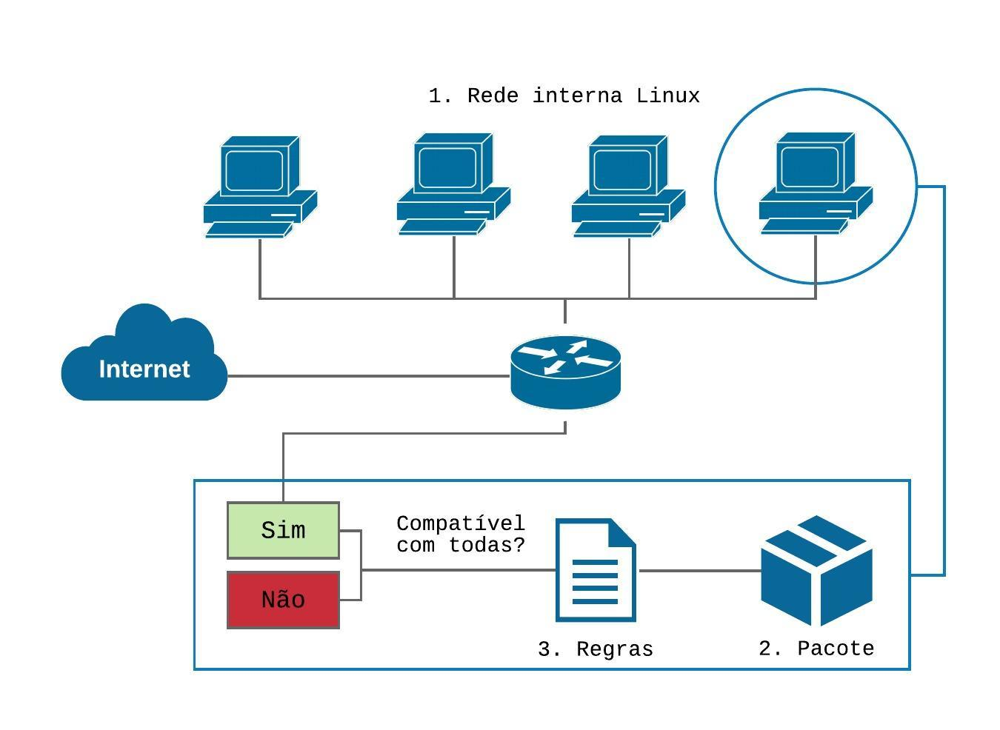

## Interface Gráfica Auxiliar na Configuração de Filtros de Pacotes em um Ambiente Linux

 

# Resumo
    Acompanhando a expansão das redes computacionais, as tecnologias
    de segurança são indispensáveis na protecão das informações e recursos de
    *hardware* nas redes privadas. Uma técnica segura, estável e eficaz disponível
    para ambientes GNU/Linux é o sistema de filtro de pacotes baseado no conjunto
    de ferramentas *Netfilter*, configurado pelo *iptables* através de linhas de código,
    tarefa que requer conhecimento técnico e criteriosa análise. Projetando um ambiente
    centrado no usuário para configuração, identificou-se a possibilidade de
    desenvolver uma interface gráfica que auxilie a configuração das regras otimizando
    o tempo de sua implantacão e melhorando seu gerenciamento.

# Introdução

    Atualmente, na rede mundial de computadores, existem incontáveis processos em andamento
    que são sigilosos, ou seja, somente a origem e o destino destes dados e informacões
    devem ter conhecimento de seu conteúdo, no entanto, para que tais dados sejam protegidos
    torna-se imprescindível a aplicação de métodos e tecnologias flexíveis, versáteis e
    que tornem as redes privadas mais seguras contra ataques de _crackers_ oriundos da rede
    externa.
    O componente de filtragem de pacotes tem por função analisar todos os pacotes
    que trafegam na rede por meio de regras previamente configuradas, corrigindo e/ou
    minimizando vulnerabilidades existentes, proporciona maior flexibilidade e controle ao
    administrador, é extremamente útil em situações simples de segurança visto que atua no
    bloqueio global de tipos específicos de pacotes que trafegam entre redes e no bloqueio
    de serviços. Sua implantaçao é de baixo custo, causa pouco impacto no desempenho,
    fornece controle de acesso e serviços para toda a rede.
    Acoplado ao Kernel dos Sistemas Operacionais GNU/Linux com versões 2.4
    ou superiores o subsistema de filtro de pacotes nativo denominado _Netfilter_ permite a
    configuração de regras que atuarão no bloqueio ou liberação de tráfego de pacotes na rede,
    e, para executá-las corretamente, requer conhecimento técnico e experiência de quem as
    configura, pois podem ocorrer diversos tipos de erros durante a sintaxe das regras que
    seguem uma lógica e uma padronização.
    Tomado o conhecimento destes parâmetros identificou-se a possibilidade de desenvolver
    uma aplicacão _localhost_ que auxilie na configuração e na aplicação dos filtros
    que atuarão no controle automático do tráfego da rede. Por meio de uma uma _interface_
    simples, amigável e intuitiva, esta apresentará opções de configuração dinâmica e objetiva,
    reduzindo assim o tempo de configuração de um _firewall iptables_.

# Filtro de Pacote

    Para autor Chapman (1992), um filtro de pacotes é um processo que atua no bloqueio ou
    liberação de pacotes de dados pela *interface* da rede, utilizando um conjunto de regras de
    filtragem pré-configuradas e a anélise é feita nas informações contidas no cabeçalho de
    cada pacote individualmente.
    Cheswick e Bellovin (2005) ressaltam que a utilização de um filtro de pacotes é
    uma solucão barata e útil na segurança de redes, pois permite filtrar pacotes com base nos
    endereços de origem ou destino ou nos números de porta.
    Todos os pacotes que trafegam na rede são analisados um a um e ações serão
    aplicadas nos pacotes que atendam ás restrições dos filtros, os pacotes que não se encaixem
    nas restrições seguirão seu fluxo de processamento normalmente para seu destino.
    À princípio, a filtragem de pacotes, atua nas camadas de rede e transporte, segundo o
    modelo *OSI*.
    A Figura 1 exemplifica, de forma global, como o filtro de pacotes atuará na rede.
    Todo o tráfego de pacotes que circular na rede interna será verificado pelas *chains* configuradas pelo administrador em um *host*. Os pacotes oriundos da rede externa serão analisados pelos filtros e, de acordo com as regras implementadas, caso atendam ás condições de
    configuração, chegarão ao *IP* de destino. Caso os pacotes não estejam em conformidade com a configuraçãp, serão bloqueados.

    Figura 1. Visão global do processo de filtragem de pacotes.

